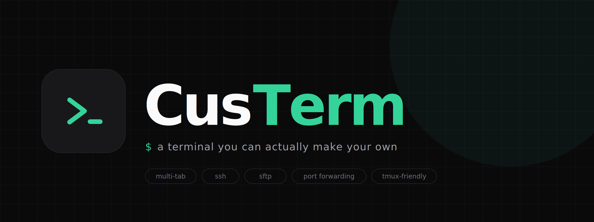
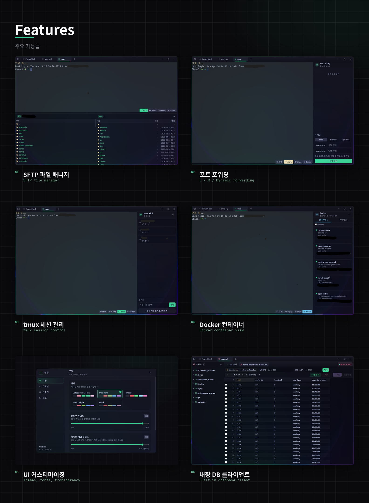

<p align="center">
  
</p>

<p align="center">
  <b>멀티탭 SSH · WSL · MySQL 클라이언트</b><br/>
  <sub>Electron + React + TypeScript로 만든, 매일 쓰기 좋게 다듬은 로컬 우선 터미널</sub>
</p>

<p align="center">
  
  
  
  
  
</p>

---

## 왜 Custerm?

기존 터미널들은 **SSH만** 되거나, **DB는 또 따로** 띄워야 하거나, **파일 전송은 다른 앱**에서 해야 했습니다.
Custerm은 하루 종일 서버 작업을 하는 사람을 위해 **자주 쓰는 도구들을 한 창에** 묶었습니다.

- **멀티탭** — SSH / WSL / MySQL을 탭으로 자유롭게 섞어 사용
- **안전한 자격증명** — 비밀번호·passphrase는 OS 키체인(keytar)에 암호화 저장, 외부 전송 없음
- **깔끔한 다크 테마** — Catppuccin 기반 + 민트 브랜드 액센트, 배경 블러(Acrylic) 지원
- **가볍고 로컬 우선** — 모든 설정·프로필은 로컬에만, 계정 가입·로그인 불필요

---

## 주요 기능

<p align="center">
  
</p>

- **SSH / WSL 터미널** — xterm.js 기반 (True Color · Unicode 11 · 웹 링크), WSL 배포판 자동 감지
- **SFTP 파일 매니저** — 드래그 앤 드롭 업로드 / 다운로드, 실시간 전송 진행률, 병렬 전송
- **포트 포워딩** — SSH 터널로 원격 포트를 로컬에 매핑, 프로필당 여러 터널 · 상태 표시
- **tmux 패널** — SSH / WSL 세션의 tmux 세션·윈도우를 GUI 로 attach / detach / kill
- **Docker 패널** — 원격 호스트 컨테이너 목록·상태 실시간 표시, start / stop / logs 즉시 실행
- **UI 커스터마이징** — 테마 · 폰트 · 투명도 · Acrylic 블러 즉시 변경

### 내장 DB 클라이언트 (DataGrip 스타일)

터미널 앱에서 따로 DB 도구를 띄울 필요 없이, **같은 창 안에서 쿼리를 날릴 수 있습니다.**

- **프로필 기반 접속** — 직접 연결 또는 **기존 SSH 프로필로 터널 경유**
- 데이터베이스 → 테이블(뷰) → 컬럼 **트리 탐색**
- **Monaco SQL 에디터** — 문법 하이라이트, `Ctrl+Enter` 로 현재 문 실행
- **가상 스크롤 결과 그리드** — 10만 행도 부드럽게, 정렬 / CSV 복사 / NULL·BLOB 렌더
- 쿼리 **취소** (`KILL QUERY`), 실행 시간 / 영향받은 행 수 표시
- 테이블 더블클릭 → `SELECT * LIMIT 200` 자동 삽입·실행

### 주요 단축키

| 단축키 | 동작 |
|---|---|
| `Ctrl+Shift+P` | 명령어 팔레트 |
| `Ctrl+Enter` | SQL 현재 문 실행 (DB 탭) |
| `Ctrl+Shift+Enter` | SQL 전체 실행 (DB 탭) |
| `Esc` | 다이얼로그 / 팔레트 / 설정창 닫기 |

---

## 기술 스택

| 영역 | 사용 |
|------|------|
| 런타임 | Electron 41 |
| UI | React 19 · TypeScript 5.8 · Tailwind CSS 3.4 |
| 애니메이션 | Framer Motion |
| 터미널 | xterm.js (+ fit · unicode11 · web-links) |
| SSH | ssh2 + node-pty |
| DB | mysql2 + Monaco Editor + TanStack Virtual/Table |
| 자격증명 | keytar (OS 키체인) |
| 번들러 / 패키징 | Vite + electron-builder |

---

## 시작하기

### 요구 사항
- Node.js 18 이상
- Windows 10/11 · macOS (Apple Silicon) · Linux
- **Windows 에서 패키징** 시 — 개발자 모드를 켜거나 관리자 PowerShell 에서 실행해야 합니다.
  electron-builder 가 내려받는 `winCodeSign` 캐시에 심볼릭 링크가 포함돼 있어 일반 권한으로는 압축 해제가 실패합니다.
- **macOS 패키징** 은 macOS 에서만 가능합니다. 네이티브 모듈(`node-pty`, `ssh2`, `keytar`) 때문에 크로스 빌드는 지원되지 않습니다.

### 개발 실행
```bash
git clone https://github.com/kimyt990501/custerm.git
cd custerm
npm install

# HMR 이 동작하는 개발 모드 (권장)
npm run dev

# Electron 으로 바로 띄워 확인하고 싶을 때 (매번 풀 빌드)
npm run electron:dev
```

### 프로덕션 빌드
```bash
# Windows (NSIS 설치 프로그램)
npm run package

# macOS (Apple Silicon · arm64 .dmg)
npm run package:mac

# Linux (AppImage)
npm run package:linux
```
빌드 산출물은 `release/` 폴더에 생성됩니다.
서명되지 않은 macOS `.dmg` 는 처음 실행할 때 Finder 에서 **우클릭 → 열기**로 한 번 허용해 주어야 합니다.

---

## 개인정보 & 보안

- **모든 설정·프로필은 로컬에만 저장**됩니다 (electron-store).
- 비밀번호·passphrase·DB 패스워드는 OS 키체인(Windows Credential Vault / macOS Keychain / libsecret)에 암호화되어 저장되며, 앱은 이를 네트워크로 전송하지 않습니다.
- 외부 분석·트래킹 없음.

### 데이터 저장 위치
| OS | 경로 |
|---|---|
| Windows | `%APPDATA%\Custerm\` |
| macOS | `~/Library/Application Support/Custerm/` |
| Linux | `~/.config/Custerm/` |

앱을 완전히 초기화하려면 위 폴더를 삭제하세요. (키체인에 저장된 비밀번호는 OS 설정에서 별도로 지울 수 있습니다.)

---

## 트러블슈팅

- **설치 후 아이콘이 예전 것으로 보임** — Windows 아이콘 캐시입니다. `ie4uinit.exe -show` 또는 탐색기 재시작 후 확인하세요.
- **macOS 에서 "확인되지 않은 개발자" 경고** — 처음 한 번만 Finder 에서 우클릭 → 열기.
- **dev 모드에서 만든 프로필이 설치본에도 보임** — 두 실행 형태가 같은 `userData` 폴더를 공유하기 때문으로 정상 동작입니다. 다른 사람 PC 에는 공유되지 않습니다.

---

## 로드맵

- [ ] 스키마 기반 SQL 자동완성
- [ ] 쿼리 히스토리 영속화
- [ ] 결과 행 인라인 편집 (PK 기반 DDL 자동 생성)
- [ ] PostgreSQL · MongoDB 지원
- [ ] ER 다이어그램 / EXPLAIN 시각화
- [ ] 터미널 분할 (split pane)

---

## 기여

이슈 · PR 모두 환영합니다. 큰 변경은 먼저 이슈로 논의해주세요.

---

<p align="center">
  
</p>

<p align="center">
  <sub>MIT License · Built with a lot of <code>Ctrl+Enter</code></sub>
</p>
